<!-- ================================================================ -->
<!--  KARTHIK BOPPANA — GITHUB PROFILE README                       -->
<!--  Search for [YOUR_PLACEHOLDER] and swap in your real links.    -->
<!--  Snake animation setup: see snake.yml (provided separately).   -->
<!-- ================================================================ -->

<!-- ===================== ANIMATED HERO BANNER ===================== -->
<!-- Custom SVG hosted in this repo, served via jsDelivr (raw.githubusercontent.com
     serves .svg as text/plain and won't render as an image — jsDelivr fixes that). -->

  

  

  
  
  
  

---

<!-- ===================== ABOUT ME ===================== -->
## 🧑‍💻 About Me

I'm **Karthik Boppana** — a student engineer who designs and ships **modern, scalable web architecture**, from responsive frontends to distributed backend systems built for real-world load. I care about **clean code, system design, and cloud-native infrastructure**, and I'm driven by turning ambitious ideas into production-grade software.

<!-- Education / goal chips — professional badge-icons instead of raw emoji -->

  
  
  
  

<!-- Interactive, click-to-expand section — native GitHub markdown, no plugins needed -->

🔍 <b>Click to read more about me</b>

 

- 🔭 Currently building a **full-stack SaaS platform** that auto-generates personal booking websites
- 🌱 Currently deepening my skills in **Next.js, Docker, Kubernetes, and AWS**
- 🎯 Actively seeking **SDE Internship / New-Grad opportunities** — let's talk!
- 👯 Open to collaborating on **open-source, distributed systems, and dev-tooling projects**
- 💬 Ask me about **React/Next.js, system design fundamentals, or cloud deployments**
- ⚡ Fun fact: **[YOUR_PLACEHOLDER — a fun fact about you]**
- 📄 Résumé: **[YOUR_PLACEHOLDER — resume link]**

 

<!-- ===================== TECH STACK ===================== -->
## 🛠️ Tech Stack

**Languages**

**Frontend**

**Backend & Databases**

**Cloud & DevOps**

 

<!-- ===================== FEATURED PROJECTS ===================== -->
## 📂 Featured Projects

<!-- Replace titles, descriptions, tags, and links with your real project details -->
<table>
  <tr>
    <td width="33%" valign="top">
      <h3 align="center">🌐 Cloud-Native Microservices Platform</h3>
      
Horizontally-scalable backend built to handle high-throughput traffic with zero single points of failure.

      

        
        
        
      

      
<a href="[YOUR_PLACEHOLDER]">Live Demo</a> · <a href="[YOUR_PLACEHOLDER]">Repo</a>

    </td>
    <td width="33%" valign="top">
      <h3 align="center">🤝 Real-Time Collaborative Workspace</h3>
      
Low-latency, multi-user workspace where teams edit and sync state instantly across sessions.

      

        
        
        
      

      
<a href="[YOUR_PLACEHOLDER]">Live Demo</a> · <a href="[YOUR_PLACEHOLDER]">Repo</a>

    </td>
    <td width="33%" valign="top">
      <h3 align="center">🤖 AI-Powered Developer Workflow Agent</h3>
      
Autonomous agent that streamlines repetitive developer workflows using LLM-driven task orchestration.

      

        
        
        
      

      
<a href="[YOUR_PLACEHOLDER]">Live Demo</a> · <a href="[YOUR_PLACEHOLDER]">Repo</a>

    </td>
  </tr>
</table>

 

<!-- ===================== CERTIFICATIONS & EDUCATION ===================== -->
## 🎓 Certifications & Education

- ☁️ **AWS Certified Cloud Practitioner** — [YOUR_PLACEHOLDER — issue date / credential link]
- ☁️ **AWS Certified Solutions Architect – Associate** — [YOUR_PLACEHOLDER — issue date / credential link]
- 🎓 **B.Tech, Computer Science and Engineering** — Vellore Institute of Technology (VIT), 3rd Year · Expected [YOUR_PLACEHOLDER — Graduation Year]

 

<!-- ===================== GITHUB STATS & ACTIVITY ===================== -->
## 📊 GitHub Stats & Activity

<!-- NOTE: github-readme-stats.vercel.app and github-readme-activity-graph.vercel.app
     are free shared services that occasionally return broken images when overloaded
     (known upstream issue, not a bug in this file). If these stop loading again,
     self-host your own copy on Vercel and swap the domain — see the guide from
     earlier in this chat. -->

 

 

<!-- 🐍 Snake contribution animation — genuinely animated, self-updating graphic.
     Setup: add snake.yml to .github/workflows/ in this repo and run it once.
     Refreshes automatically every 6 hours after that. -->

  

 

<!-- ===================== CONNECT ===================== -->
## 🤝 Connect With Me

I am actively seeking **SDE Internships** and **Full-Time SDE Roles**. If you're looking for a developer passionate about scalable systems and cloud technologies — let's connect!

  
⭐️ Thanks for stopping by — feel free to explore my repos and reach out!

